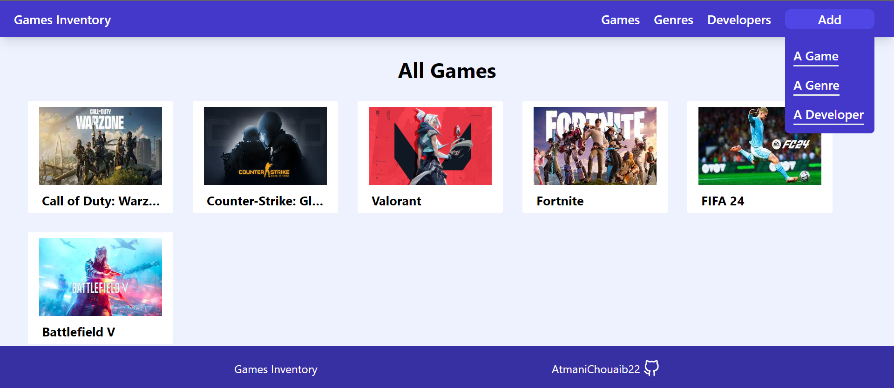

<h1>the odin project: Inventory app Project</h1>

built using mongoDb, express, node, React.js with vite, Tailwind.css , Eslint and prettier config

<h4>this project covers: </h4>
<ul>
    <li>using mongoDb for storing form data,aggregation pipelines,db data validation, virtuals</li>
    <li>relational documents and data population</li>
    <li>handling Form data</li>
    <li>Server side Error handling</li>
    <li>Building api (RESTful structure), CRUD opereation</li>
    <li>CORS middleware and configuration</li>
    <li>fetching data</li>
    <li>React OSP concept</li>
    <li>front end data fetching with external API(fakestore API)</li>
</ul>

